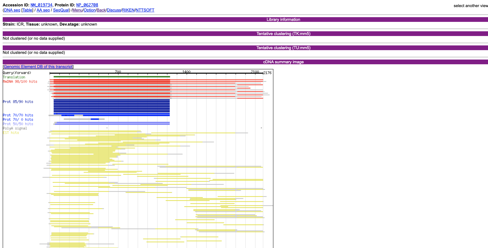

# 三島合宿日誌 

三島合宿　2019/03/04-08

[坊農さん](https://twitter.com/bonohu)のご厚意で一週間三島の遺伝研で合宿させていただけることに。雪化粧の富士山と咲き始めた桜が一度に楽しめる贅沢な季節です。その中での学びをまとめます。

## Transcript assembly

transcriptomeへの理解を得ようとtranscript assemblyを試みる。

### trinity install to mac

```
This formula was found in a tap:
homebrew/linuxbrew-core/v
To install it, run:
  brew install homebrew/linuxbrew-core/v
```

と怒られたのでbrew再インストール。

```
sudo ruby -e "$(curl -fsSL https://raw.githubusercontent.com/Homebrew/install/master/uninstall)" # brew削除
```

その後はうまくいきました。

### DDBJサーバーダウンによりDRRがダウンロードできない

代替出来るらしい。

```
fasterq-dump DRR092257
```

### githubからソースを直接ダウンロード

[teratail : githubからファイル単体をclone(DL)できる？](https://teratail.com/questions/14124)

```
curl -O https://github.com/bonohu/denovoTA/blob/master/for_trinity.pl
```

->

```
curl -O https://raw.githubusercontent.com/bonohu/denovoTA/master/for_trinity.pl
```

### trinity

Trinity v2.8.3だとsalmonが要求された。

```
conda create -n salmon salmon # v0.12.0
conda activate salmon
```

自分のMBPだけらしい。なぜ？

ほぼ丸二日かかって完成！！ -> transcriptの数を数えようとしたら間違って全て消した。犯人は

```
$ grep > Trinity.fasta  | wc -l
```

でした。正しくは。

```
grep -c \> Trinity.fasta
```

でした。`-c`でカウント。28383 transcriptsでした。ちなみに中間ファイルは残っていたので同じコマンド（trinity）を実行し直すとすぐ戻った。バックアップは取りましょう。

### blast

作ったtranscriptのfastaを作って`makeblastdb`でblast databaseを作った。これでUniprotのfastaに対してローカルにblastのデータベースを作っておけば、いつでもblast検索がかけられる。配列だけではなく、例えばid listからtranscriptの配列を取り出したりも出来る。

```
makeblastdb -in longest_orfs.pep -out trinity_rslt -dbtype prot -hash_index -parse_seqids
blastdbcmd -db trinity_rslt -entry_batch longest_orfs.Forkhead.ids > longest_orfs.Forkhead.pep
```

ちなみに配列のデータベースはUniprotがいいよとのこと。

一通り終わった！！！

## [DBCLSのSRAデータベース](http://sra.dbcls.jp/index.html)を日本最速で試す。

爆速になってました。これでシーケンスデータをサクサク検索、ダウンロードできる。とても嬉しい。


## byobu

一つのサーバーのshellに複数端末でアクセスするとして、（sshなど）共通のプロセスが見れる。ローカルの接続が切れても安心。

- [Bonoがbyobuで上手にbashのスクリプトを書いた](https://bonohu.wordpress.com/2018/01/03/bono-byobu-bash/)
- [byobu使ってみた](https://bonohu.wordpress.com/2015/08/06/byobu/)

### コマンド

[https://linuxfan.info/terminal-with-byobu](https://linuxfan.info/terminal-with-byobu)

- F2 ／ エスケープキー C : 新しいウィンドウを作る
- F3 ／ エスケープキー P ／ Alt + ← : 前のウィンドウに切り替える
- F4 ／ エスケープキー N ／ Alt + → : 次のウィンドウに切り替える
- F5 : プロファイルをリロードする
- F6 ／ エスケープキー D : デタッチする
- F7 : スクロールバック／検索モードに切り替える
- F8 : ウィンドウのタイトルを変更する
- F9 : Byobuの設定メニューを表示する
- Alt-Pageup : 上にスクロール
- Alt-Down : 下にスクロール
- Shift-F2 : ウィンドウを横に分割
- Ctrl-F2 : ウィンドウを縦に分割
- Shift-F3 : 次のスプリットに切り替える
- Shift-F4 : 前のスプリットに切り替える

しかしMBPで落ちまくるのでひとまず放置。落ちるタイミングはconfigを開こうとしたとき。


## QuickLookのプラグインがいっぱいある

かの[togotv](http://togotv.dbcls.jp/)で[小野さん](https://github.com/hiromasaono)発信。便利。

[Mac の QuickLook で プラグインをまとめてインストールする](https://qiita.com/exabugs/items/9a392077c492ed97950d)


## [Refex](http://refex.dbcls.jp/index.php?lang=ja)

[小野さん](https://github.com/hiromasaono)作。組織特異的な遺伝子発現量や、オントロジー、gene familyなどがまとまっている。CAGEがとても使いやすい。


ESTなる実験手法が昔は使われていたらしいことも学ぶ。

## salmonがmacで動かない問題

```
conda create -n salmon salmon # v0.12.0
conda activate salmon

salmon index --threads 4 --transcripts gencode.vM19.transcripts.fa.gz --index salmon_index_mouse --type quasi -k 31 --gencode

salmon quant -i salmon_index_mouse \
      -l A \
      -r SRR1269711_trimmed.fastq.gz   \
      -p 4 \
      -o salmon_output_SRR1269711 \
      --gcBias
```

これは動いたが、[https://github.com/yyoshiaki/auto_counttable_maker/blob/master/MakeCountTable_Illumina_trimgalore_SRR.sh#L316-L341](https://github.com/yyoshiaki/auto_counttable_maker/blob/master/MakeCountTable_Illumina_trimgalore_SRR.sh#L316-L341)動かず。。。

`combinelab/salmon:0.12.0`にしてもだめ。

indexをつくる途中で止まっている。

そもそも、公式のcontainerがdockerfileをつけていないのが今ひとつ。しかし、おととい0.13.0に上がっていたのでそれで解決されていることを期待。

[https://hub.docker.com/r/combinelab/salmon/tags](https://hub.docker.com/r/combinelab/salmon/tags)

無理だった。

condaのほうが行けたので、いっそOS判別してmacだけcondaで動くようにしようかな。
[Qiita : シェルスクリプトでOSを判別する](https://qiita.com/UmedaTakefumi/items/fe02d17264de6c78443d)

macで割り振るメモリを増やすと動いた！！[DBCLS大田さん](https://github.com/inutano)に教えてもらった。詳しくは[https://github.com/yyoshiaki/auto_counttable_maker/blob/master/README.md#mac%E3%81%AE%E3%81%B2%E3%81%A8](https://github.com/yyoshiaki/auto_counttable_maker/blob/master/README.md#mac%E3%81%AE%E3%81%B2%E3%81%A8)。

## kallisto output -> idep

tximportでまとめる。
[https://github.com/yyoshiaki/auto_counttable_maker/blob/master/tximport_R.R](https://github.com/yyoshiaki/auto_counttable_maker/blob/master/tximport_R.R)

ensemblはいろんな生物種を扱う人にはいい。確かに。人とマウスならやっぱり[GENCODE](https://www.gencodegenes.org/)。

ensemblはbiomartでいろんなテーブルが作れる。transcriptのversion付のもの（ENST00000254657.3）がrow nameになるのでめんどくさい。.以下をperlで落とすやり方も聞いたが、tximportで落とすならめんどくさい。やはり、ヒト、マウスならGENCODEかな。

ちなみに、salmon or sailfishなら、mikelove氏の[tximeta](https://bioconductor.org/packages/release/bioc/vignettes/tximeta/inst/doc/tximeta.html)（tximportの後継）で一発。kallistoは対応していない。

```
dir <- system.file("extdata/salmon_dm", package="tximportData")
# here gzipped, normally these are not
files <- file.path(dir, "SRR1197474_cdna", "quant.sf.gz")
# file.exists(files)

coldata <- data.frame(files, names="SRR1197474", condition="A", stringsAsFactors=FALSE)
# coldata

library(tximeta)
se <- tximeta(coldata)

gse <- summarizeToGene(se)
```

DESeq2への受け渡しもすぐ。

```
suppressPackageStartupMessages(library(DESeq2))
# here there is a single sample so we use ~1.
# expect a warning that there is only a single sample...
suppressWarnings({dds <- DESeqDataSet(gse, ~1)})
## using counts and average transcript lengths from tximeta
dds <- estimateSizeFactors(dds)
```

## R update on Mac

久々のローカル環境で、Rが3.4だったため、アップデートを試みる。

1. [Rが3.5.0へメジャーアップデートしたので簡単アップデート](https://makoto-shimizu.com/news/r-3-5-is-released/) : だめだった
2. [https://stackoverflow.com/questions/13656699/update-r-using-rstudio](https://stackoverflow.com/questions/13656699/update-r-using-rstudio)

[https://cran.r-project.org/](https://cran.r-project.org/)から落とす。恐れずにインストーラーで入れてみた。Rstudioを再起動したら入ってた。その後、`update.packages() `でパッケージのアップデート。

## [GENDOO](https://gendoo.dbcls.jp/)

MeSH vocabularyをOMIMを使って遺伝子と紐づけしたデータベース。gene setに対する応用はchi2 distの再生性を使えばOK?（メモ）

> Nakazato, T., Bono, H., Matsuda, H. & Takagi, T. Gendoo: Functional profiling of gene and disease features using MeSH vocabulary. Nucleic Acids Res. 37, W166–W169 (2009).


## [cDNA viewer](http://fantom3.gsc.riken.jp/public/annotate/main.cgi?masterid=random)

FANTOMの可視化。今のようなgenomeに対する可視化ではなく、cDNAに対する可視化を行っていた。randomにしていたのは開発テスト用。



ちなみにFANTOM話でもう一つ震えるような話を聞いた。

> 山中伸弥教授らは、人工多能性幹細胞(iPS細胞)の樹立研究において、FANTOMデータベースから、細胞の初期化因子候補として24種の転写因子を選定しました

[FANTOM](http://fantom.gsc.riken.jp/jp/)

[スライド](https://www.slideshare.net/sayamatcher/dbcls-sponsored-session-introduction)も

## [gggenome](http://gggenome.dbcls.jp/), [ggrna](http://ggrna.dbcls.jp/)

少し前から使ってたが、作者の[meso_cacase](https://twitter.com/meso_cacase)さんと出会う。恐るべしDBCLS。ちなみに個人的な好みはpandasでの呼び出し。[scikit-bio](http://scikit-bio.org/)と組み合わせて使った。

```
import pandas as pd

df = pd.read_csv('http://gggenome.dbcls.jp/mm10/2/+/TTCATTGACAACATTGCGT.txt', sep='\t', comment='#')
```

実験医学の別刷りもらった。わーい。

## ドーミーイン三島

屋上の露天風呂から富士山がみえる（らしい）。場所も三島から歩いて5分以内でいい感じ。どうやらここが正解と思っていいらしい。ただし、初日回線が100kb/sでgtfのダウンロードすらままならなかった。その後は比較的速く、隣人のネット状況に依存するように思う。優先との速度比較を行った。

- 無線 : 8-12Mb/s
- 有線 : 計測できず。 -> 30Mb/s

しまった、コネクタを遺伝研に忘れた。これは明日。
-> 借りたコネクタがMBP(2016 late)では認識されなかった。平岡のMBP(2015)で測れた。

洗濯はただ。感想は20分100円、100円硬貨限定。

## 2400c


## loomの話

とりあえずcsv->loom。scanpyでやってみようかな。とりあえず、[AOE](http://aoe.dbcls.jp/)で検索したGEOのsingle cell RNA-seqのテーブルを読み込み、loomで保存してみる。[notebook](csv2loom/scanpy.ipynb)にまとめた。

ちなみにmacでは

```
loompy requires Python '>=3.6' but the running Python is 3.5.4
```

というショックな表示が出た。

```
conda install python=3.6
```

3.7は何個かのライブラリが嫌だと言っていたので妥協したのだが、ずっとupdateできなかったので結局新しい環境を作る。。

```
conda create -n py36_scanpy python=3.6

conda install seaborn scikit-learn statsmodels numba pytables
conda install -c conda-forge python-igraph louvain

pip install scanpy
```


## juliaインストール

[https://julialang.org/](https://julialang.org/)

dmgをダウンロードしてしまったので、

```
export PATH=/Applications/Julia-1.1.app/Contents/Resources/julia/bin:$PATH
```

で`~/.bash_profile`にpathを通した。本当は、

```
$ brew cask install julia
```

だとpathが通ってよかった。jupyter labで読めるようにIJuliaをインストール。

```
using Pkg
Pkg.add("IJulia")
```

[https://github.com/JuliaLang/IJulia.jl](https://github.com/JuliaLang/IJulia.jl)

ubuntuの方は`~/Program`に[https://julialang.org/downloads/index.html](https://julialang.org/downloads/index.html)でダウンロード、解凍して、.bashrcのpathを1.1に置き換えた。

## cellfishing.jl

[https://www.biorxiv.org/content/biorxiv/early/2018/07/25/374462.full.pdf](https://www.biorxiv.org/content/biorxiv/early/2018/07/25/374462.full.pdf)
[https://github.com/bicycle1885/CellFishing.jl](https://github.com/bicycle1885/CellFishing.jl)

julia1.1でインストール。

```
$ julia -e 'using Pkg; Pkg.add(PackageSpec(url="git://github.com/bicycle1885/CellFishing.jl.git"))'
```

```
$ julia -e 'using Pkg; Pkg.test("CellFishing")'
```

入った入った。ubuntuもいれたった。

以下[bonohu blog](https://bonohu.github.io/cellfishing.html)より。一部改変。実行ファイルはgithubから持ってくる。

```
curl -O https://raw.githubusercontent.com/bicycle1885/CellFishing.jl/master/bin/cellfishing
chmod 755 cellfishing
julia -e 'import Pkg; Pkg.add("HDF5")'
julia -e 'import Pkg; Pkg.add("DocOpt")'
```

データは[Planaria Single Cell Atlas website](https://shiny.mdc-berlin.de/psca/)。

### Getting data for the search

```
curl -O http://bimsbstatic.mdc-berlin.de/rajewsky/PSCA/all_sgete_4GU75.loom.gz
gzip -dc all_sgete_4GU75.loom.gz > Plass2018.dge.loom
```
After getting the file, I successfully ran the code!

### Run CellFishing

```
julia cellfishing build Plass2018.dge.loom
julia cellfishing search Plass2018.dge.loom.cf Plass2018.dge.loom >neighbors.tsv
```

### tabula muris

- https://tabula-muris.ds.czbiohub.org/
- https://www.ncbi.nlm.nih.gov/geo/query/acc.cgi?acc=GSE109774

Abstract
Tabula Muris is a compendium of single cell transcriptome data from the model organism Mus musculus, containing nearly 100,000 cells from 20 organs and tissues. The data allow for direct and controlled comparison of gene expression in cell types shared between tissues, such as immune cells from distinct anatomical locations. They also allow for a comparison of two distinct technical approaches:

microfluidic droplet-based 3’-end counting: provides a survey of thousands of cells per organ at relatively low coverage
FACS-based full length transcript analysis: provides higher sensitivity and coverage.
We hope this rich collection of annotated cells will be a useful resource for:

Defining gene expression in previously poorly-characterized cell populations.
Validating findings in future targeted single-cell studies.
Developing of methods for integrating datasets (eg between the FACS and droplet experiments), characterizing batch effects, and quantifying the variation of gene expression in a many cell types between organs and animals.
The peer reviewed article describing the analysis and findings is available on Nature.

[Figshare](https://figshare.com/projects/Tabula_Muris_Transcriptomic_characterization_of_20_organs_and_tissues_from_Mus_musculus_at_single_cell_resolution/27733)に公開されていた。以下の手順で`./data/tabula_muris`にダウンロード、解凍。

```
wget https://ndownloader.figshare.com/files/10700143
unzip 10700143
wget https://ndownloader.figshare.com/files/10700161
mv 10700161 metadata_droplet.csv
wget https://ndownloader.figshare.com/files/13088039
mv 13088039 annotations_droplet.csv

# droplet
wget https://ndownloader.figshare.com/files/10700167
unzip 10700167
wget https://ndownloader.figshare.com/files/13088129
mv 13088129 annotations_facs.csv
wget https://ndownloader.figshare.com/files/10842785
mv 10842785 metadata_FACS.csv
```


```
import numpy as np
import pandas as pd
# import scanpy.api as sc
import scanpy as sc # versin1.4 以降
import matplotlib.pyplot as plt
import os
import seaborn as sns
%matplotlib inline

sc.settings.verbosity = 3  # verbosity: errors (0), warnings (1), info (2), hints (3)
sc.settings.set_figure_params(dpi=80, color_map='viridis', transparent=False)  # low dpi (dots per inch) yields small inline figures

import matplotlib as mpl
# 2 lines below solved the facecolor problem.
# mpl.rcParams['figure.facecolor'] = 'white'
mpl.rcParams['figure.facecolor'] = (1,1,1,1)

sc.settings.autosave = True
sc.logging.print_version_and_date()
sc.logging.print_versions_dependencies_numerics()
# results_file = './scanpy/write/180313merge.mt.h5ad'
# sc.settings.figdir = './scanpy/write/180313merge.mt/graph'
# results_file = './scanpy/write/180514merge.mt.h5ad'
# sc.settings.figdir = './scanpy/write/180514merge.mt/graph'
# sc.settings.cachedir = './scanpy/write/180514merge.mt/cache'

version_date = '20190307'
results_file_facs = 'scdata/{}_tabula_muris_facs.loom'.format(version_date)
results_file_droplet = 'scdata/{}_tabula_muris_droplet.loom'.format(version_date)
sc.settings.figdir = 'scdata/{}_tabula_muris/graph'.format(version_date)
%config InlineBackend.figure_format = 'retina'
# %config InlineBackend.figure_format = 'svg'

root_dir_data = 'data/tabula_muris/'

list_csv_facs = [x for x in os.listdir(root_dir_data+'FACS') if x[-3:]=='csv']
list_csv_droplet = [x for x in os.listdir(root_dir_data+'droplet') if x[0]!='.']

for i, f in enumerate(list_csv_droplet):
    if i == 0:
        adata_droplet = sc.read_10x_mtx(root_dir_data+'droplet/'+f)
        adata_droplet.obs.index = [f.split('-')[1]+'_'+x.split('-')[0] for x in adata_droplet.obs.index]
    else:
        _adata = sc.read_10x_mtx(root_dir_data+'droplet/'+f)
        _adata.obs.index = [f.split('-')[1]+'_'+x.split('-')[0] for x in _adata.obs.index]
        adata_droplet = adata_droplet.concatenate(_adata)

_adata = 0
adata_droplet.var = adata_droplet.var.drop(list(adata_droplet.var.columns), axis=1)
adata_droplet.obs.index = [x.split('-')[0] for x in adata_droplet.obs.index]

df_anno_droplet = pd.read_csv('data/tabula_muris/annotations_droplet.csv', index_col=0)
df_anno_droplet.head()

adata_droplet = adata_droplet[df_anno_droplet.index,:]

for c in df_anno_droplet.columns:
    adata_droplet.obs[c] = df_anno_droplet.loc[adata_droplet.obs.index, c]

adata_droplet.write_loom('10x.loom')
```

サーバー落ちた。


## auto_counttable_maker

アドバイスをいただく。

- ['--validateMappings' option to 'salmon quant' #16](https://github.com/yyoshiaki/auto_counttable_maker/issues/16)
- [fasterq-dump #17](https://github.com/yyoshiaki/auto_counttable_maker/issues/17)

[--validatemappings](https://salmon.readthedocs.io/en/latest/salmon.html#validatemappings)

> One potential artifact that may arise from alignment-free mapping techniques is spurious mappings. These may either be reads that do not arise from some target being quantified, but nonetheless exhibit some match against them (e.g. contaminants) or, more commonly, mapping a read to a larger set of quantification targets than would be supported by an optimal or near-optimal alignment.

ふむふむ。

## 坊農さんの研究の話

RNAseq, microarrayのメタアナリシス

[biorxiv : Meta-analysis of hypoxic transcriptomes from public databases](https://www.biorxiv.org/content/biorxiv/early/2018/02/23/267310.full.pdf)

いろんな組織の酸素応答をup,down,unchangedに落として、sum。すべてのデータtableなどをfigshareで公開。

### データの作り方

[AOE](http://aoe.dbcls.jp/)でcurationして、[google spreadsheetにまとめて](https://figshare.com/articles/Human_list_of_RNA-seq_datasets_before_and_after_hypoxic_stress/5811987/1)自動でRNA定量を行っていた。

## tensorflow2.0 alpha

まだalphaなので気長に待とう。[homepage](https://www.tensorflow.org/?hl=ja)もかっこよくなってる。

[TensorFlow 2.0 Alpha](https://www.tensorflow.org/alpha)

## デビル顔面腫瘍性疾患(DFTD）

細胞自身が他の個体に移るらしい。これによりタスマニアデビルは絶滅の危機にさらされているらしい。

## Dockerのエラー対処方法

[DBCLS大田さん](https://github.com/inutano)に教えてもらった。

DRUNの--rmを外して走らせて、終わったあとsalmonが落ちたらdocker inspect idでstatus0 or 1やメモリの量を調べる。

## 停電

雷で停電した。ひえっ。
